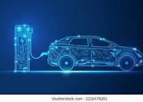

# ⚡ Electric Vehicle Population Analytics

 <div align="center">
    
  </div>

<p align="center">
  
  
  
  
</p>

<p align="center">
  <code>⚡ ELECTRIC VEHICLE INTELLIGENCE</code> &nbsp;•&nbsp; <code>📈 DASHBOARD ANALYTICS</code> &nbsp;•&nbsp; <code>🔋 BEV + PHEV</code>
</p>

<p align="center">
  
</p>

<p align="center">
  <strong> Analysis of electric-vehicle registrations, adoption patterns, vehicle mix, and CAFV eligibility.</strong>
</p>

<p align="center">
  <a href="tableau/Electric_Vehicle.twb">Tableau workbook</a> ·
  <a href="data/raw/Electric_Vehicle_Population_Data.csv">Raw data</a> ·
  <a href="presentation/Electric%20Vehicle%20Presentation.pptx">Project brief</a>
</p>

---
## 📌 Project overview

This project turns the supplied electric-vehicle population extract into an interactive Tableau analysis. It answers practical questions about the size of the registered EV population, BEV/PHEV mix, range, leading makes and models, location, and Clean Alternative Fuel Vehicle (CAFV) eligibility.

The accompanying presentation defines the intended KPI and chart requirements; the figures in this README were calculated directly from the supplied CSV so they are independently reproducible.

## 🎯 Objectives

- Measure the total unique electric-vehicle population and its model-year distribution.
- Compare Battery Electric Vehicles (BEVs) with Plug-in Hybrid Electric Vehicles (PHEVs).
- Track average electric range and flag data characteristics that can affect that KPI.
- Identify leading makes, models, and geographic concentrations.
- Examine CAFV eligibility status to support incentive and policy analysis.

## 📁 Project structure

```text
Electric-Vehicle-Analytics/
├── README.md
├── assets/
│   └── EV.jpeg                                   # Supplied project cover visual
├── data/
│   └── raw/
│       └── Electric_Vehicle_Population_Data.csv  # Source dataset
├── tableau/
│   └── Electric_Vehicle.twb                      # Tableau workbook
└── presentation/
    └── Electric Vehicle Presentation.pptx        # KPI and visual requirements
```

## 🧰 Tools and files

| Asset | Purpose |
|---|---|
| [Electric_Vehicle_Population_Data.csv](data/raw/Electric_Vehicle_Population_Data.csv) | Raw vehicle-level population extract used for all analysis. |
| [Electric_Vehicle.twb](tableau/Electric_Vehicle.twb) | Tableau workbook containing the dashboard, worksheets, calculations, and Top N parameter. |
| [Electric Vehicle Presentation.pptx](<presentation/Electric Vehicle Presentation.pptx>) | Project brief that specifies the required KPIs and charts. |
| [EV.jpeg](assets/EV.jpeg) | Supplied electric-vehicle illustration used as the project cover. |

## 📊 Data at a glance

| Metric | Result |
|---|---:|
| Rows / unique DOL Vehicle IDs | 150,482 / 150,482 |
| Columns | 17 |
| Model years represented | 1997–2024 |
| BEV records | 116,807 (77.62%) |
| PHEV records | 33,675 (22.38%) |
| Average published electric range | 67.88 miles |
| Primary state represented | Washington — 150,141 records (99.77%) |


## 🗂️ Raw data structure

**Grain:** one vehicle record, uniquely identified in this extract by `DOL Vehicle ID`.

| Column | Recommended type | Description |
|---|---|---|
| `VIN (1-10)` | Text | First 10 characters of the vehicle identification number. |
| `County` | Text | County of the registered vehicle. |
| `City` | Text | City of the registered vehicle. |
| `State` | Text | State or jurisdiction code. |
| `Postal Code` | Text | Postal code; retain as text to preserve leading zeros. |
| `Model Year` | Whole number | Vehicle model year. |
| `Make` | Text | Vehicle manufacturer/brand. |
| `Model` | Text | Vehicle model name. |
| `Electric Vehicle Type` | Categorical text | `Battery Electric Vehicle (BEV)` or `Plug-in Hybrid Electric Vehicle (PHEV)`. |
| `Clean Alternative Fuel Vehicle (CAFV) Eligibility` | Categorical text | CAFV incentive eligibility/research status. |
| `Electric Range` | Whole number | Published electric range in miles. |
| `Base MSRP` | Currency / whole number | Published base MSRP; zero requires interpretation before price analysis. |
| `Legislative District` | Text / whole number | Legislative district of the vehicle record. |
| `DOL Vehicle ID` | Text | Department of Licensing vehicle identifier; used as the distinct-count key. |
| `Vehicle Location` | Geographic text | Longitude/latitude `POINT` value for mapping. |
| `Electric Utility` | Text | Associated electric utility or utilities; some values contain multiple utilities. |
| `2020 Census Tract` | Text | 2020 Census tract identifier; retain as text to avoid losing precision or leading zeros. |

## 💼 Business questions and answers

| Business question | Answer from the supplied data |
|---|---|
| **How large is the EV population?** | The extract contains **150,482** records and the same number of unique DOL Vehicle IDs, so no duplicate vehicle IDs were found. |
| **Which propulsion type is dominant?** | **BEVs lead with 116,807 records (77.62%)**; PHEVs account for **33,675 (22.38%)**. |
| **Which make has the largest presence?** | **Tesla** leads with **68,983 vehicles (45.84%)**, followed by Nissan (13,497) and Chevrolet (12,026). This is registry share within the extract, not a national market-share estimate. |
| **Which models are most common?** | **Tesla Model Y** is first with **28,502 (18.94%)**, narrowly ahead of **Tesla Model 3** with **27,709 (18.41%)**. Together they represent **37.35%** of records. |
| **Where are EVs concentrated?** | **King County** has **79,075 vehicles (52.55%)**, far above Snohomish County (17,307) and Pierce County (11,542). |
| **How does CAFV eligibility break down?** | **62,951 (41.83%)** are CAFV eligible; **17,833 (11.85%)** are ineligible due to low battery range; **69,698 (46.32%)** have an eligibility status not researched. |
| **What is the average electric range?** | The Tableau-style average across all published values is **67.88 miles**. Because **69,698** records have range `0`, the average of positive-range records is **126.44 miles**; choose the definition deliberately before presenting range performance. |
| **What does the model-year trend suggest?** | **2023** is the largest model year in the extract with **37,079 vehicles (24.64%)**. The **642** records for 2024 should not be interpreted as a drop without a data-refresh date or completeness check. |

## 📈 Dashboard coverage

The Tableau workbook includes one dashboard and nine worksheets aligned to the presentation requirements:

| Worksheet / component | Analysis purpose | Suggested visual |
|---|---|---|
| Total Vehicles | Unique vehicle population KPI | KPI card |
| Avg Electric Range | Mean electric range KPI | KPI card |
| Total BEV Vehicles | BEV count and share KPI | KPI card |
| Total PHEV Vehicles | PHEV count and share KPI | KPI card |
| Total Vehicles by Model Year | EV adoption pattern from 2010 onward | Line / area chart |
| Total Vehicles by State | Geographic distribution | Map |
| Top 10 Total Vehicles by Make | Leading makes | Bar chart |
| Total Vehicles by CAFV Eligibility | Eligibility split | Donut / pie chart |
| Total Models by Model | Most common models | Treemap |

The workbook also includes a **Top N** parameter with a default value of **10** for the make/model rankings.

## 🧮 Core Tableau calculations

Use `COUNTD([DOL Vehicle ID])` for all vehicle-count KPIs. The following calculation definitions reproduce the intended metrics:

```tableau
// Total Vehicles
COUNTD([DOL Vehicle ID])

// Avg Electric Range
AVG([Electric Range])

// Total BEV Vehicles
COUNTD(
    IF [Electric Vehicle Type] = "Battery Electric Vehicle (BEV)"
    THEN [DOL Vehicle ID]
    END
)

// Total PHEV Vehicles
COUNTD(
    IF [Electric Vehicle Type] = "Plug-in Hybrid Electric Vehicle (PHEV)"
    THEN [DOL Vehicle ID]
    END
)
```

> ⚠️ **Workbook validation note:** the supplied workbook’s BEV calculation spells the category as `Battery ELectric Vehicle (BEV)`. Update it to `Battery Electric Vehicle (BEV)` exactly as shown above, then refresh the BEV KPI and its percentage. The corrected raw-data result is **116,807 BEVs (77.62%)**.

## ✅ Data-quality notes

- **Key integrity:** `DOL Vehicle ID` is complete and unique across all 150,482 rows.
- **Minor missingness:** `County`, `City`, `Postal Code`, `Electric Utility`, and `2020 Census Tract` each have 3 blanks; `Vehicle Location` has 7; `Legislative District` has 341.
- **Zero values need business context:** 69,698 records have `Electric Range = 0`, while 147,027 have `Base MSRP = 0`. These are populated values rather than blank cells, but they should not automatically be treated as genuine zero range or price in downstream analysis.
- **Geographic concentration:** 99.77% of rows are in Washington. A state map is still useful for record distribution, but it should not be labelled as a representative US adoption map.

## 🚀 Open and refresh the dashboard

1. Open [Electric_Vehicle.twb](tableau/Electric_Vehicle.twb) in Tableau Desktop.
2. If Tableau cannot find the data, use **Data → Edit Connection** and select [Electric_Vehicle_Population_Data.csv](data/raw/Electric_Vehicle_Population_Data.csv).
3. Correct the BEV calculation noted above, then refresh the data source.
4. Review `Dashboard 1`, adjust the **Top N** parameter, and publish/export as needed.

## 🔜 Recommended next steps

- Add a source-extract date and refresh cadence so model-year trends are not mistaken for annual registrations or sales.
- Create a documented rule for zero range and zero MSRP before using either field in executive KPIs.
- Add descriptive tooltips, date labels, and a clear “Washington-focused” scope label to the published dashboard.
- Replace the supplied cover visual before public use if you do not hold the necessary image rights; it contains a visible Shutterstock watermark.

---

## 📄 Dataset & Usage Note

This project uses the **Electric Vehicle Population Dataset** for analytical purposes. Remove personal or sensitive information before sharing derivative datasets or public dashboards.

---

# 🤝 Connect With Me

## 👨‍💻 Author

**Rajay Jain**

* **📧 Email**: jainrajay2001@gmail.com  
* **💼 LinkedIn**: [www.linkedin.com/in/rajay-ajay-jain-a3abb4168](https://www.linkedin.com/in/rajay-ajay-jain-a3abb4168)  
* **🐙 GitHub**: [https://github.com/RajayJain](https://github.com/RajayJain)  

---

## ⭐ Support

If you find this analysis framework resourceful or helpful for your retail applications, please consider giving this project repository a ⭐ on GitHub!


---

<div align="center">
  
</div>
